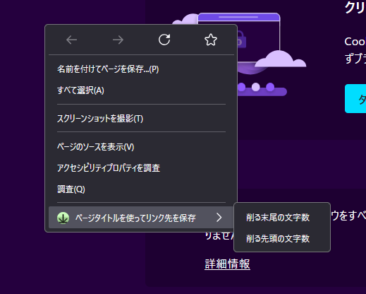

## 日本語 Ver.

掲載ページ: [addons.mozilla.org](https://addons.mozilla.org/ja/firefox/addon/save-as-using-page-title/)

コンテキストメニュー（右クリックメニュー）にページタイトル+拡張子をファイル名としたダウンロードを開始しようとする機能を追加するFirefoxの拡張機能。
使用感としては、右クリックで”リンク先を保存...”というのがあるが、それのファイル名を置き換えるバージョンを目指している。

追加の設定としてページタイトルの前後の文字数をそれぞれ削除する文字数を指定できるようにしている。これはページタイトルによってはサイト名などが入っているのでそれが邪魔な場合があるかもしれないからである。

スクリーンショットにちょうどいいリンクがないので、保存のためのメニューアイテムのスクリーンショットはない。申し訳ない。

## English ver.

Extension page: [addons.mozilla.org](https://addons.mozilla.org/ja/firefox/addon/save-as-using-page-title/)

Firefox extension that adds a function to the context menu (right-click menu) that tries to start a download with the title + extension as the file name.

The usage is to right-click on "Save link to..."but is intended to be a version that replaces the file name of that.

There is no screenshot of the menu item for saving, as there is no link suitable for a screenshot. Sorry.